## Introduction

In the next hour, I will help you grasp some of the essential identity concepts and jargon. As well as explain the fundamental problems these systems attempt to solve.

This talk is intended as a big picture introduction so that when we approach more in-depth topics, we have a frame of reference on what we are discussing: OAuth, SAML, JWTs, Claims, Tokens and all the other mysterious beasts that you will encounter when working with identity.

### The Problem

Let’s talk about the problem we are trying to solve when we talk about identity.

The idea is that you have a resource somewhere. That resource can be a capability like executing a specific process. It could be a bit of sensitive data. Or pretty much anything else that you can think of when you are using an application.

And you have a user somewhere that you would like to access this resource in a way that is secure; meaning it only allows proper usage of the resource. 

There are not only authentication aspects of this transaction but also authorization as well.

The problem is deceivingly simple; you have a user who wants to access a resource. If you look at this picture, it looks easy, right?

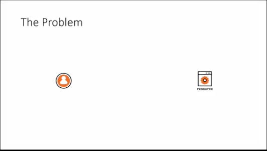

There are several things to consider that raise the complexity level.

Firstly, the problem space we are talking about is extremely critical. If something goes wrong, it goes catastrophically wrong. Think 10 million euros level of catastrophe in the event of a breach. This fact alone makes it one that requires a lot of attention.

Next, resources are complex and so is consuming those resources. We exist in a world where everything is programmable; everything has an API exposed. And those resources can be accessed by a large variety of devices: your computer, phone, watch, thermostat. Have you been to Home Depot and seen the refrigerators that allow you to tweet?

Finally, the accounts we use to access all of these resources exist in an incredibly wide variety of sources. Users can come from businesses, enterprises or directories. Users can come from social networks; almost everyone has a Facebook or Twitter or LinkedIn account. Users can come from entirely custom solutions were an ISV or startup decides to put all of their users in their own database with their own rules.

Now, consider the Cartesian product of all the possible devices, resources and user sources, and you can see why the problem can become complex very quickly.

Also, consider that the developers implementing these things in an organization are not typically experts in this space and they have little desire to get a PhD in identity and security.

### The Role of Open Standards

We can start attacking this complexity in isolation attempting to brute force a solution that addresses every possible combination of the aforementioned Cartesian product.

While that is technically possible, it is probably physically unfeasible. There is far too much to address and still actually build a product at the same time.

Of course, this is not a new problem. Managing access to resources has been with us since our old neckbeard ancestors created computing machines. One way the industry has tackled this complexity was to develop protocols defined by open standards.

Open standards are essentially an agreement or set of agreements that different large players within the industry developed while determining the canonical/standard ways of describing authentication and authorization transactions without exposing any details of the implementation of the various artifacts.

These standards define roles that each artifact can play. You have resources that consume identities. You can have identity providers that are the custodians of user identities; keeping track of credentials and similar things. Finally, you can have transactions that join the two together; for instance, a user can go to any identity provider and present proof of authentication to a resource.

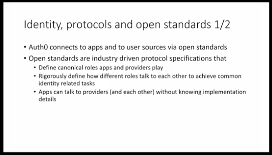

Accomplishing anything without open standards would require intimate knowledge of the implementation of every part of the platforms we want to use. Each one of those platforms might do things slightly differently; sometimes significantly different.

Having open standards allows us to follow highly prescriptive protocols that describe all the way down to the bits we send on the wire which will enable us to decouple ourselves from implementation details of things we do not control.

Someone can tell us they have a resource that uses standard "X." We immediately know how to go about interacting with that resource without having to know if it was written in Java, Rails, Fortran or whatever else comes to mind.

Some of the standards I will cover in this talk and that you will hear about in general when working in this space are:

- OpenID Connect - an authentication protocol
- OAuth2 - a delegated authorization protocol
- SAML - a somewhat dated protocol that is still relevant because governments, financial institutions, and universities widely adopted it.

## History of the Industry

Let's take a historical tour to see how the industry evolved the various standards from the most pedestrian simplest in use to modern protocols.

### Business/Enterprise Use Casees

#### Username and Password

Concepts:
 - Digital Identity
 - Raw Credentials

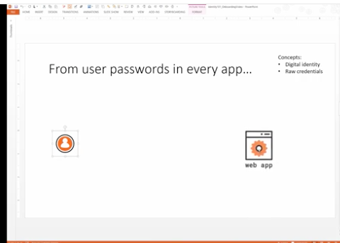

Username and password is the classic scenario, but let's look at a practical example. Here I have a user and an application. The application can truly be any application; here I am using a web application because it is the most common example. You can think of it as any resource a user might want to access.

Think about that application and what it is trying to achieve. Is it Amazon and I am trying to buy something? Is it an expense system where I am trying to track expenditures? Or is it a tax system that I am using to file my taxes?

All of these applications perform a business function, and for each of those functions, there will be a different set of attributes which define me as a user that is relevant to the application.

For example, Amazon would want to know my credit card number and physical address to send stuff. The tax system would want to know my yearly income and tax identification number. These attributes are still me; I am the same person but depending on the application I am working with my attributes, or digital identity, will be different.

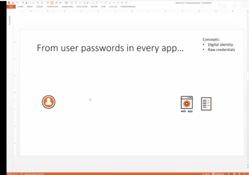

A digital identity is a specific set of attributes that define me within the scope of a given application. The application should use those attributes when performing its business function on my behalf.

Let's say yesterday I connected to the application for the first time and entered my attributes into the system. Then today, I come back to the application. How does the application know that it should use my attributes vs. those of my colleague?

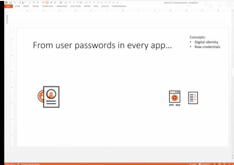

And here comes the oldest solution we have; I must provide credentials in the form of username and password. Between the application and myself is an agreement to share a secret; something that only I and the app knows. I will provide this secret to the application to reassure it that I am the same person who showed up yesterday, so retrieve the attributes that belong to me as my digital identity.

Both username and password are used to allow some flexibility around changing the password. When the password changes, the link between me and my digital identity would be much harder if we just used a password. Adding a username allow us to associate the digital identity to it and my secret password is free to change as needed. 

The combination of the username identifier and shared password secret proves my identity to the application. The fact that I know the password proves I am the same person that signed up to the app yesterday.

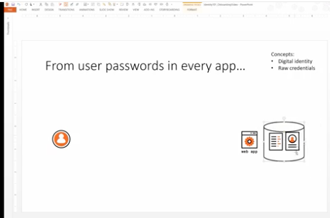

At a minimum, I need to present both my username and password every time I sign in. The application needs to store both my credentials and my digital identity in some form of data store.

Username and password is the simplest form of authentication that I can think of. And it is easy enough to implement; most application frameworks come with this method out of the box, and most beginner programming books teach some variant of it.

Even though it is a primitive approach, username and password are still in everyday use today. Which is one of the interesting aspects of identity; there isn't a strict replacement of the old method when a new one comes along. Typically new techniques come along to address new scenarios that were not possible before; evolving to increasing complexity. However, the old protocols and old approaches, if they still work and there is no direct competitor, then they will still be in use.

#### Directories

Concepts:
 - Directory
 - Boundaries/Perimeter
 - Kerberos

The next evolutionary step was intended to solve a specific problem. The scenario I previously described reflects the worldview of personal computing. One where users are using applications pretty much in isolation and each application is providing its own function.

Think for a second about what happens within a business. Typically a user, in this case, an employee, will end up using a collection of applications for performing their job duties. They might need to use an expense system, a human resources system, an email system, and other similar things. Within the boundary of a company or enterprise, you can expect a user to use multiple applications.

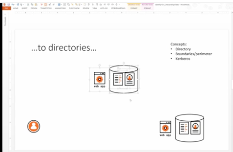

If we use the same username and password approach as before, treating each application like an island, we will end up with every user having their credentials stored in every application. The user must authenticate with every application they wish to use; requiring them to remember passwords for each application. Or worse, using a single password for them ensuring they are compromised in multiple places when the password leaks.

In general, having multiple apps deal with attributes collection and credentials management separately in isolation is a colossal waste of resources for everyone. For the developer, they need to duplicate the same functionality in every application and keep them up to date. For the user, they need to deal with provisioning all these accounts and managing passwords. But above all and very important for our business, our administrators need to chase every application and make sure every user is configured correctly in each app. When a user leaves the company, the will need to access every system and update that users access along with hope and pray that they know every application they had access.

The username and password approach doesn't scale in this scenario. The industry reacted to this by creating what is now known as a directory.

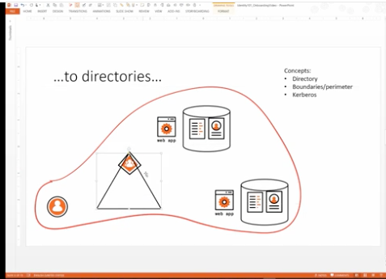

A directory is a centralized repository that performs the credential management, and digital identity storage described earlier. It is a central place where the company can gather attributes of their employees and credential management is handled.

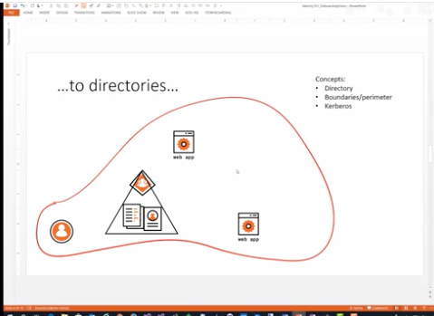

Directories centralize this functionality in one place, and everyone is happier. 

The user only needs to signup once with the directory. They need to authenticate once with one central entity, and they will be signed in automatically with all the applications that they require to perform their job; which is very convenient.

The applications, of course, do not need to deal with authentication directly, so there are a time and cost savings. There is also security benefit as well because with a centralized directory there is a smaller security surface.

Finally, administrators have one central place to provision a user or update when a user leaves the company causing the user to gain or lose access to all the applications everywhere. They no longer need to worry about missing an application and the user still having access to a critical system in the enterprise.

The introduction of a directory nicely solves the problem of networked computing within a single company. It offers single sign-on, an important feature for users. We have a centralized place to manage users, an important feature for administrators. And we don't have to duplicate identity-related code; we can rely on infrastructure an important feature for developers.

#### Cross-Domain Single Sign-On

Concepts:
 - SAML
 - Trust
 - Claims
 - Session Cookies
 - Shadow Accounts

Within the boundary of an enterprise, directories solve a critical problem. However, this is far from being the end. Once the industry solved the problem of internal identity, they soon discovered that wasn't nearly enough for driving all their business needs.

Consider one of the most straightforward business scenarios, a retailer. A retailer has all of its own internal flows and user management requirements. But the business goes beyond the boundaries of their enterprise. A retailer has suppliers, people managing their warehouse (typically outsourced), corporate customers with whom they have an organization to organization relationship, which is different from an individual customer.

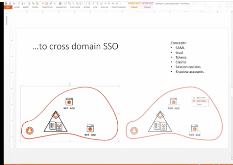

Internal directory based single sign-on and authentication within the boundaries of an enterprise no longer work when you have more than one company that need to collaborate.

In particular, think of the scenario here. Imagine that there is a web application in the domain on the right that a user from the domain on the left. The domain controller on the right only knows about users within the boundaries of the company on the right. The user from the other company does not exist in the directory.

So now what? There are different solutions to the problem, but I can assert with authority that the brute force method is not the way to go; it has significant shortcomings. The industry considers it an anti-pattern.

Of course, I am talking about shadow accounts. Shadow accounts are when the administrator of the company on the right that has the resource creates an entry in their directory for the user from the company on the left. Which allows the user to gain access to the resource in the same way a local user would.

Shadow accounts take us back to the same problem that we had before within the company where we had different apps dealing with their own credentials. The company on the right now has a user from the company on the left in their database.  When the user leaves the company on the left, the company on the right doesn't necessarily know. The user can still go to the company on the right's application and gain access.

Imagine if I were fired from Auth0 but were still able to go to our Egencia partner site and book travel around the world at Auth0's expense. That is clearly a big red flashing career-ending problem.

The industry addressed this by raising the level of abstraction in the world of protocols. Kerberos and the protocols that work within the boundaries of an enterprise operate at the network level. To operate at the network level the solution needs to be within a well-known boundary possibly requiring a certain kind of network hardware. All of which is not possible when you have to collaborate across the public internet.

People at the time looked at the roles, messages, and primitives defined at the network level and created a representation for those things at the higher application level. These protocols were named SAML, or Security Assertion Markup Language. SAML is a protocol that describes the roles entities can play in the context of identity transactions; an application or resource became known as a service provider, a source of identities became known as an identity provider. SAML defines messages exchanged across the different entities specifying high-level transactions used for connecting the separate entities without knowing implementation details.

Raising the level of abstraction to the application level removes the need to rely on special network hardware.

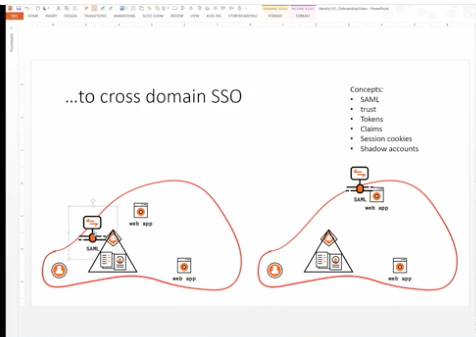

How does SAML work though? Imagine sitting in front of the web application on the right is some software; the specific kind of software doesn't matter, but it is often in the form of middleware. Middleware is a piece of software that executes in the context of a request and are usually built up into chains that can act on the request. Middleware tends to implement orthogonal concerns to the application using it. Which allows the application to remain ignorant of SAML concerns; they are handled transparently by the middleware.

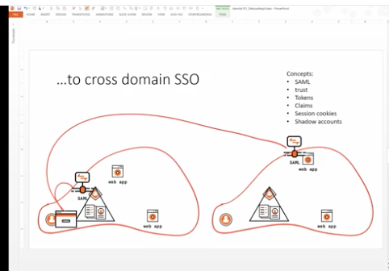

In the example of two companies collaborating, the one on the right must configure their system to have a trust relationship with the one on the left. Trust means the applications for the company on the right will believe anything the identity provider belonging to the company on the left says about users. If the identity provider on the left says that this user is valid and authenticated correctly, the application on the right will trust that assertion.

The concept of trust is this; it is saying "I am an application and I trust that this source of identity information is telling me the truth."

When the user in the domain on the left requests access to the application in the domain on the right, the SAML implementation will intercept the request and determine the user is unauthenticated. 

The SAML implementation then crafts a sign-in message using a well-known format and redirects the browser of the user to the trusted identity provider. That provider is some local resource to the user from the company on the left. In most cases, the user is already authenticated with the identity provider because it is within the boundaries of the company on the left's enterprise.

This is a good demonstration of how the various protocols layer on top of each other to provide additional functionality. The company on the left could be an entirely Microsoft shop using Active Directory to provide directory services to the company. The company on the right could be using a completely different directory service. The SAML implementation sitting on top on both sides provides a seamless integration point translating between the two boundaries.

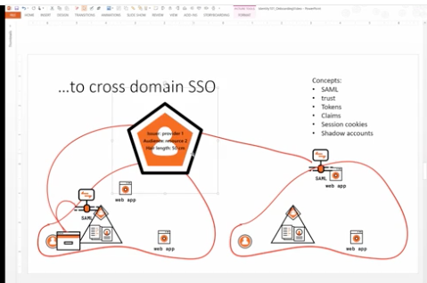

Continuing with the SAML flow; once the user successfully authenticates, the identity provider on the left issues an entity called a security token. A security token is just a bunch of bits that represent the proof that the user has successfully authenticated with the provider. 

A SAML based security token consists of an XML payload and a digital signature. The digital signature provides confidence that the content of the XML payload is truly coming from the trusted identity provider as opposed to something that was injected by some man in the middle actor.

This concept is key to maintaining trust. The company on the right can say they trust what the identity provider on the left says about users, but there must be a way to verify messages are coming from the identity provider on the left.

Another aspect of the SAML security token is that it can contain the user-specific attributes that describe the user in question which allows the application consuming the token to have no need to cache those attributes. It can receive the attributes that are important for the function it provides directly from the token. Which completely removes the shadow account anti-pattern littering the directory of the company on the right's directory with non-employee information. That information is simply supplied on the fly.

An attribute that travels inside a security token describing a user is called a claim. A claim is an attribute combined with a signature asserting the attribute came for a specific source.

To make this more clear, consider the difference between me putting my name on a post-it note and trying to enter Canada vs. pulling out my passport that shows my name. The medium here makes all the difference. The passport is allegedly difficult to counterfeit. Whoever receives it can validate it is a good passport and can have trust that the US government says my full name is Robert Presley Johnson. The post-it, on the other hand, has no credibility at all. It could have come from anywhere; I may or may not have written it.

Claims in a security token can be trusted because we trust the issuer of the token and can validate that the token has come from that issuer.

Claims can be specified by the protocol or by the authority issuing the token. SAML defines an issuer and audience claim. 

The issuer claim says who issued this token. Which could be figured out based on the signature, but having a string that represents the origin of the token is important. The audience claim is also critical as it restricts the actions a user can perform within a system.

Tokens are also scoped to an audience by the audience claim. Resources that receive tokens which are not for the appropriate audience can reject them.

Consider your checking account at your bank. If you receive a check that is made out to someone other than you, you will not accept it because your bank will not cash that check. The bank can see the check is for someone else. Even though the check is perfectly valid, it is scoped wrong for you. A security tokens audience claim works in the same way. 

Finally, security tokens can contain arbitrary claims as well. For instance, this token says that the user has blue hair. The consuming application may or may not use it, but it can trust that the origin identity provider asserts the claim is valid.

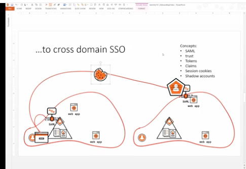

To recap: 

- The user from the company on the left used their browser to access the application inside the company on the rights domain. 
- The SAML middleware determined that the user was not authenticated and redirected them to the identity provider it trusts on the left. 
- The identity provider on the left uses Kerberos to authenticate the user and then generates a security token to send along with the user back to the application on the right.
- The SAML middleware validates the token by checking its signature, the audience, and the issuer.
- Once the middleware concludes the token is coming from a trusted source and is valid, it considers the user authenticated and issues a session cookie that typically contains the attributes from the token.

Now every time the user interacts with the application, the session cookie is used to identify the user which reduces the network traffic required for each request. The session cookie is used instead of having to do the authentication/token validation dance for every request.

This lengthy description of SAML has a silver lining. The concepts do not apply only to SAML; it applies to other protocols as well. Generally, all the things I've just described are pretty much the pattern used by nearly all modern authentication protocols. 

### The Consumer Internet

So far we have been exploring years of the history of identity in the world of business. Meanwhile, the consumer world was pretty much at a standstill. Each public facing website allowed consumers to log in with username and password to access their services.

But a problem arose when these services began attempting to access other publically available services on the user's behalf.

#### Username and Password

Consider the following scenario. Say I am a generic internet user using LinkedIn, a very popular consumer application. LinkedIn decides that it would like to take advantage of the fact that I already have contacts in other apps I am using to send LinkedIn invitations to my friends and acquaintances.

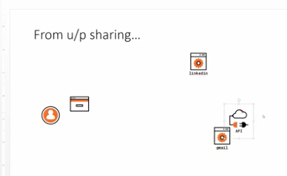

For example, assume that Gmail has its APIs that they use in their applications to send emails, list contacts, and similar email-y type things. LinkedIn would like to send invitations on my behalf to all of my Gmail contacts taking advantage of the same APIs.

A common pattern that exists today to solve this problem is for LinkedIn to request my Gmail credentials. Gmail has a database containing username and password credentials and user attributes similar to what I have described before. LinkedIn simply asks for those credentials which it stores and uses to access your Gmail contacts and send invites to them.

Giving your Gmail username and password to LinkedIn presents a significant problem. It might be legitimate for both LinkedIn and Gmail and me to want to do this, especially if I want to expand my LinkedIn network. It is to the advantage of all involved to automate the process, but the implementation is terrible.

I must now rely on LinkedIn to protect my Gmail credentials. LinkedIn might not be as committed to that protection as Gmail because they do not own them; Gmail does.

Note that I am using LinkedIn and Gmail here because I want to give a real-world example. I am not trying to say anything nefarious about their engineering practices. They are just an example.

What happens if LinkedIn does not adequately secure the connection between my browser and their site when they ask for my Gmail credentials? It might be possible for someone on the wifi network at Starbucks to intercept my Gmail credentials.

Of course, Gmail would never make this mistake because their business depends on the security of my credentials. But LinkedIn on the other hand, maybe not. They are asking for the credentials for a one-off little feature of their application. It's not as critical to them.

But it might be even more obscure than that, maybe LinkedIn uses centralized logging or network hardware that caches request; either might save your Gmail credentials in an insecure way. There are all sorts of bad things that could happen.

There is an even more subtle problem here. With the Gmail username and password, LinkedIn has full access to everything within my Gmail account. Not only can they harvest my contacts but they can also read my emails, send emails on my behalf, and delete things. They can do whatever they like, which is crazy of course. Why would LinkedIn want to do that? I am just saying the possibility is there.

In general, people should never give credentials to any place other than the origin of those credentials.

#### Delegated Authorization

Concepts:
 - OAuth2
 - Authorization Server
 - Clients
 - Delegation
 - Scopes
 - Access Token
 - Refresh Token

The industry solved this big problem in a fairly organic fashion; meaning there were no significant community efforts at first. Companies started to use some practices, and those practices became more generic over time.

The industry introduced OAuth as an open standard to address precisely the problem I have just described. OAuth is a delegated authorization protocol. It allows a user to delegate authorization to one resource to act on a third resource without exposing the user's credentials used to access the third resource.

OAuth is a standard that defines two endpoints which resource such as Gmail and LinkedIn can expose for helping people do delegated authorization flows. It also describes how a client should consume such a resource in a delegated fashion; explicitly prescribing the messages that should be used for requesting such access.

Lets' go back to the scenario. Say that I am signed in with LinkedIn, and they want to harvest my Gmail contacts for sending invites. Following OAuth, LinkedIn directs my browser to what is called an Authorization Server hosted by Gmail. 

An Authorization Server is just a collection of two endpoints defined by OAuth:

1. Authorization Endpoint - which serves up UI
2. Token Endpoint - which deals with API access

Gmail's authorization server receives the redirected request from LinkedIn. This request is formatted to say something like "Dear Gmail, I am LinkedIn. You know me because I am registered with you, I am a known client. Here I have a user. I would like you to grant access to  their contacts and the ability to send emails on behalf of this user."

At this point,  my browser is pointed at Gmail. Gmail will authenticate my session if I am not currently logged in. This authentication is happening in the proper way; I am sending my Gmail credentials to Gmail.

Once Gmail has validated my Gmail credentials, it examines the incoming request and prompts me saying "Dear user, Here is LinkedIn. They would like to access your contacts and to send emails on your behalf. Are you OK with that?" I as a user am given the change to respond that I am OK with LinkedIn having this specific access.

Once granted that permission, Gmail's authorization server will generate an authorization code and redirect my browser back to LinkedIn with it. The authorization code is an opaque string as far as LinkedIn is concerned. Only Gmail knows anything about it. 

So far this handshake is performed directly in my browser over the public internet. Once my browser is redirected back to LinkedIn with the authorization code, LinkedIn will continue the flow server side.

LinkedIn will take the authorization code along with its set of client credentials and call Gmail's authorization server's token endpoint. This message is saying "Dear Gmail, I am LinkedIn; here is proof. I have a code that proves this user gave consent for me to access your APIs on their behalf."

Note: LinkedIn got Gmail client credentials when it registered with Gmail as a known client. OAuth defines client credentials as a way to prove application identity.

Gmail's authorization server will first evaluate the client credentials and then the authorization code. If everything checks out, it will generate two artifacts.

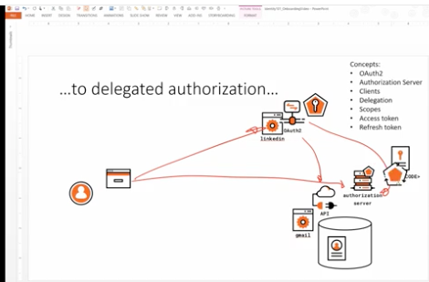

First, an opaque access token is generated. I as a user consented to give access and this token proves that as well as the permissions that granted. These permissions are typically expressed in the context of OAuth as scopes. 

I say this is an opaque token because it contains no valuable information for LinkedIn. The token only has meaning to Gmail, its issuer. OAuth specification has no advice on the format of the token as long as it is capable of conveying meaning to Gmail.

Secondly, an opaque refresh token is generated. If LinkedIn wishes to maintain Gmail API access when the user is not available, the refresh token can be used to request a new access token.

Typically access tokens are short-lived and expire after a set amount of time has passed. By using the refresh token to request another one from Gmail's authorization server, it allows the authorization to be re-evaluated in the event something has changed. Maybe I have revoked LinkedIn's access or deleted my account completely; no access token should be issued in either case.

The refresh token serves another purpose as well. It allows LinkedIn to bypass the authorization dance with me as a user every time it needs an access token. I as a user might get very irritated with LinkedIn and Gmail if they continually prompted me for consent.

This is how the industry solved the delegation problem, and OAuth2 is a very popular protocol today.

#### Cross-Domain Single Sign-On

Concepts:
 - OpenID Connect
 - ID Token
 - JWT
 - User Info Endpoint

Of course, things did not end there. Quickly people started to use OAuth, not for delegation, bit as an authentication mechanism.

Consider our final scenario. Imagine that LinkedIn does not want to maintain its own username and password store; they would have no way of signing-in directly. LinkedIn could do the same OAuth dance I described earlier to gain delegated access to Gmail's API with an anonymous user.

As soon as the OAuth flow is completed successfully, LinkedIn could assume that since the user has proven they are a valid Gmail user, they are considered authenticated by LinkedIn as well; drop a session cookie and continue.

In this process, LinkedIn has effectively abused OAuth to infer successfully gaining delegated access to Gmail's API means the user is authenticated in LinkedIn; outsourcing the authentication mechanism to Gmail's delegated API access.

Remember with OAuth the access token is opaque. The token issued by Gmail has no meaning to LinkedIn. If someone manages to make an attack and the access token I get from Gmail happens to belong to another user, LinkedIn has no way of telling. LinkedIn will be giving the user the illusion of being authenticated; when in reality the token belongs to someone else. This is known as the "confused deputy attack," and it is problem number one.

Problem two is that this approach cannot be generalized. When I described SAML earlier, I said that if I know that a website uses SAML; I can connect to it. That is because all of the messages in SAML are well documented. The security token that is passed around has meaning to both parties. I can rely on the digital identity claims made in the token as a consumer. SAML is well specified, and I can use an SDK that implements the entire protocol.

In this scenario, the OAuth access token is opaque to LinkedIn. The only way to use it is to send it back to Gmail with a request. LinkedIn has no access to the claims contained in the token; to get user claims it would have to call a Gmail API to retrieve them.

Gmail has an API for doing this. And Facebook has an API for doing this. And ActiveDirectory has an API for doing this. But OAuth does not give us guidance for implementing such an endpoint. They all could be very different. So an identity SDK built on the OAuth specification is incomplete; which is our last problem.

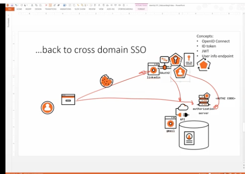

The industry took OAuth and added details on top of it known as OpenID Connect or OIDC to solve this problem. OpenID Connect takes OAuth and adds primitives for correctly achieving sign-on.

OIDC adds a new type of token called an id token. This token is no longer opaque it follows a format called JSON Web Token or JWT for short. This token is meant to carry pretty much the same information as I described in the SAML security token. It carries user information and can be validated in the same way.

OIDC also introduces a standard API interface to the authorization server for querying identity information called the User Info API.

Finally, OIDC introduces a way to get id tokens directly as part of the authorization endpoint flow which brings the public internet up to parity with SAML.

And we are now finally at modern times, OpenID Connect is state of the art at this point for identity protocols. We have now visited the main scenarios that prompted the evolution of protocols in the identity space. 

Of course, this was just a taste of the world of identity and how the industry evolved from a simple username and password to OpenID Connect. In the coming months, we will hear from speakers who dive deeper into these topics.
